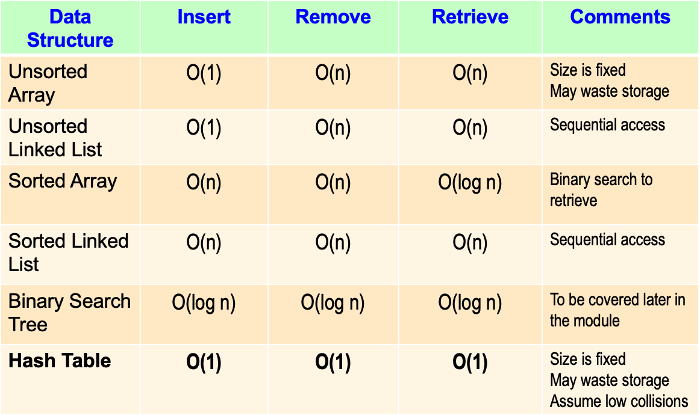
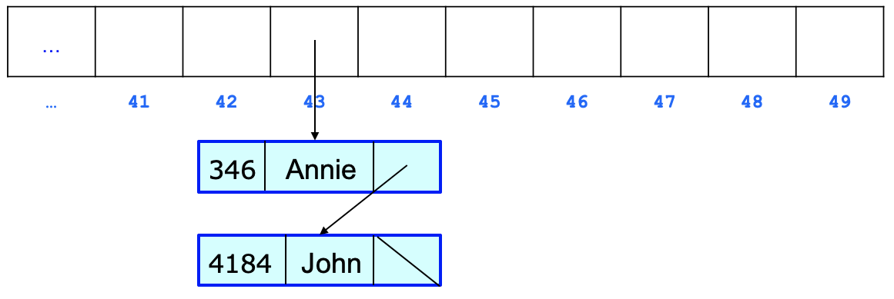

# Hash Table

## Dictionaries

Useful for managing data by some search value 

### Dictionary ADT

- Is a collection of items
- Items are referenced by search key
    - The search key may be complex data type
- When new item are added, the search key must be specified
- Items are retrieved using their search key

### Implementing Dictionary ADT

List of operations 

- create an empty dictionary
- insert a new item into the dictionary
- remove the item with a given search key from the dictionary
- get the item with a given search key from the dictionary (retrieve)
- check whether the dictionary is empty
- get the number of items in the dictionary
- destory the dictionary

Specify the Dictionary ADT

- Dictionary()
- add(KeyType, ItemType): boolean
- remove(KeyType): void
- get(KeyType): ItemType
- isEmpty(): boolean
- getLength(): int
- ~Dictionary()

Implement the Dictionary



## Hash Tables

- Is an array
- Uses a hashing function to map a key *K* to an index in the array
    - h(k) = i, where i is an interger in (0, MAX_SIZE-1)
- When adding a new item *x* with key *k*
    - Table[h(k)] = x

## Hashing Functions

$h(k) = k % MAX_SIZE$ % MAX_SIZE

- Is vaild hash function if the key *k* is an integer

A perfect has function maps each serach key to a **unique** integer

- Map a Singaporean using NRIC number
- Map a book using ISBN number

## Resolving Collisions

Often we will map 2 different keys to the same interger, which causes a collision 

**E.G.**

h(346) = h(4184) = 43

**To resolve this:**

We can use separate chaining.

- Each array element is linked lis
- When a collision occurs, add the item to the list



## Operations

### Add

- compute the index using the hash function
- check if key exists while traversing to the last node
- Create a new node to store the item
- Make the last node's pointer to poiunt to the new node
- Increase the size by 1

```cpp
bool Dictionary::add(KeyType newKey, ItemType newItem){
    // Compute the index using hash function
    int hashValue = hash(newKey);

    Node* node = items[hashValue];

    //Create a new node
    Node* newNode = new Node;

    //Items and keys
    newNode->item = newItem;
    newNode->key = newKey;
    newNode->next = NULL;

    // If list at index is empty
    if(!node){

        //Set list at index to point to new node 
        items[hashValue] = newNode;
        
        

    } else {

        Node* temp = node;
        while (temp)
        {
            if(temp->key == newNode->key){
                return false;
            }
            temp = temp->next;
        }

        
        while(node->next){
            node = node->next;
        }

        node->next = newNode;
        

    }
    
    // Increase the size by 1
    size++;
    // Return true  
    
    return true;

}
```

### Remove

```cpp
void Dictionary::remove(KeyType key){
    //Compute the index using hash function
    int hashValue = hash(key);
    Node* node = items[hashValue]; 

    // If list at index is not empty
    if(node){
        //Perform list remove of item with specified key
        
        Node* current = node;

        if(current->key == key){
            Node* temp = current->next;
            current->next = NULL;
            current = temp;
            items[hashValue] = current;
            
        }else{
            while (current->next)
            {
                if(current->next->key ==  key){
                    Node* temp = node->next->next;
                    current->next->next = NULL;
                    current->next = NULL;
                    current->next = temp;

                }
                current = current->next;
            }
        }
        

        //Decrease the size by 1
        size--;

    }

}
```

## Advantage and Disadvantages of Hash Tables

yet to do